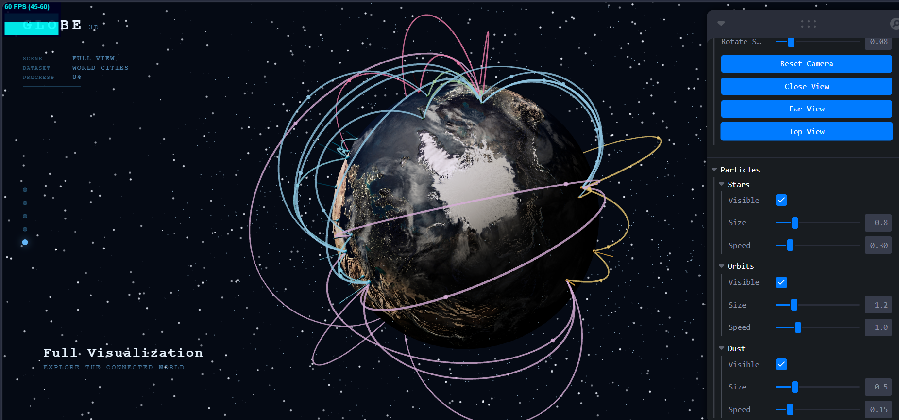
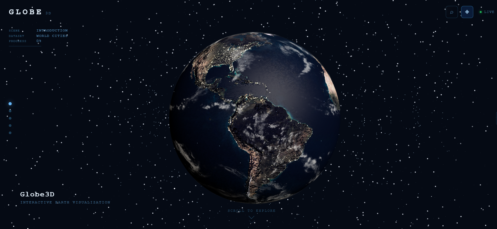
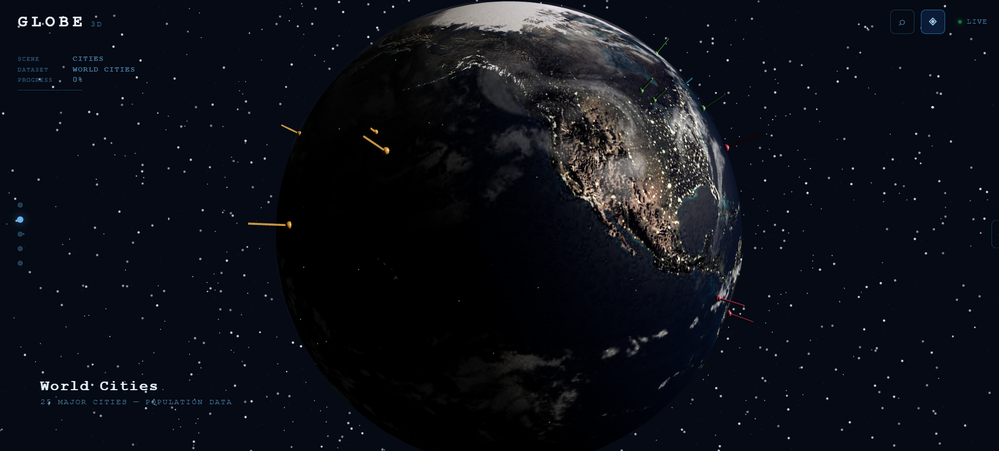
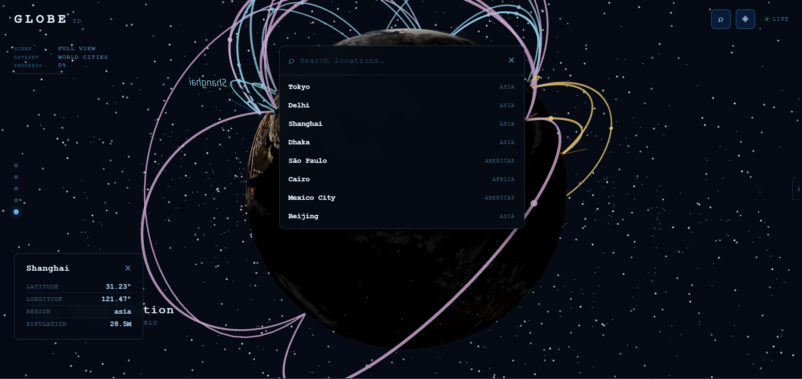

# Globe3D — WebGL-Powered 3D Earth Data Visualization

<p align="center">
  
</p>

<p align="center">

<a href="https://webgl-data-globe.vercel.app/" target="_blank">
  
</a>


</p>

> Production-quality interactive 3D globe built with React 18, Three.js, and custom GLSL shaders. A cinematic, scroll-driven storytelling experience with geospatial data visualization, flight route animation, particle systems, and a fully custom camera engine.

---

## Live Demo

🚀 **Live Application:** https://webgl-data-globe.vercel.app/

If you'd like to run it locally, follow the installation instructions below.
---

## Features

- **Realistic Earth** — 2048×1024 day/night texture compositing, specular ocean maps, normal-mapped terrain, GLSL atmosphere shader
- **Cinematic Camera** — custom spherical-coordinate camera, GSAP-driven transitions, smooth-damp interpolation, 5 named presets
- **Scroll Storytelling** — GSAP ScrollTrigger drives a 5-scene cinematic progression revealing layers progressively
- **Data Visualization** — 25 world cities with animated sphere markers, value-driven spike charts, billboard labels
- **Flight Routes** — 35 great-circle arcs with draw-range reveal animation and traveling particles
- **Particle Engine** — 3 `BufferGeometry` systems (star field, orbital rings, ambient dust) — zero per-frame allocations
- **GLSL Shader Framework** — custom atmosphere (Fresnel + sun scatter), glow, animated FBM noise, GPU star shader
- **Advanced UI** — spring-animated side panel, location search with camera focus, HUD, tooltips, scene indicator
- **Scene Director** — centralized coordinator for camera, layer visibility, and scene transitions

---

## Screenshots

### 🌍 Realistic Earth

<p align="center">
  
</p>

---

### ✈️ Flight Route Visualization

<p align="center">
  
</p>

---


### 📊 Interactive Data Visualization

<p align="center">
  
</p>

---


### 🎛️ Interactive Control Panel

<p align="center">
  
</p>

---

## Architecture

                    Globe3D

                       │

        ┌──────────────┼──────────────┐

        │              │              │

        ▼              ▼              ▼

 Scene Director   Camera Engine   UI Layer

        │              │              │

        └──────────────┼──────────────┘

                       ▼

               Rendering Engine

                       │

      ┌──────────┬──────────┬──────────┐

      ▼          ▼          ▼          ▼

    Earth      Routes    Particles   Shaders

                       │

                       ▼

                Visualization Layer

                       │

          ┌────────────┴────────────┐

          ▼                         ▼

       Markers                  Labels

The project follows a modular architecture where each subsystem is independently reusable and communicates through centralized state management and the Scene Director.

> 📖 **Want a deeper technical overview?** See **[ARCHITECTURE.md](ARCHITECTURE.md)**.
---

## Technical Highlights

### Rendering Engine

- Custom React Three Fiber rendering pipeline with centralized renderer configuration.
- Frame-rate independent animation loop using delta-time updates.
- Modular scene composition with reusable rendering systems.
- Optimized for stable **60 FPS** on Intel Iris Xe Graphics.

### Camera System

- Fully custom spherical-coordinate camera engine (no OrbitControls in production).
- Smooth interpolation with configurable damping and cinematic camera presets.
- Scene Director integration for timeline-driven camera transitions.
- Mobile-friendly touch controls with constrained zoom and rotation.

### Visualization Engine

- Geographic coordinate conversion (Latitude/Longitude → 3D World Space).
- Data-driven marker, spike, and label rendering architecture.
- Great-circle interpolation for realistic globe route visualization.
- Modular dataset system supporting multiple visualization layers.

### Shader Framework

- Custom GLSL shader architecture with centralized uniform management.
- Fresnel-based atmosphere shader.
- GPU-animated procedural noise.
- Reusable glow material system.
- Shared GLSL utility library for future shader extensions.

### Particle Engine

- High-performance particle systems using `BufferGeometry` and `Points`.
- Shared geometry and material resources.
- Zero per-frame heap allocations inside animation loops.
- Modular particle manager supporting stars, orbital rings, and ambient space particles.

### Performance Optimizations

- Shared shader uniform updates.
- Geometry and material reuse.
- Cached texture loading.
- Adaptive device pixel ratio.
- Draw-range based route animation.
- Memoized React components where appropriate.
- Minimal React re-renders through Zustand state management.

### Software Architecture

- Scene Director coordinating camera, animation, UI, and visualization layers.
- Modular subsystem design with clear separation of responsibilities.
- Reusable rendering, animation, and shader frameworks.
- Production-oriented project structure designed for long-term scalability.

---

## Technical Challenges & Solutions

| Challenge | Solution |
|-----------|----------|
| Rendering thousands of visual elements efficiently | Built reusable `BufferGeometry`-based rendering systems and eliminated per-frame object allocations. |
| Creating realistic flight paths on a sphere | Implemented great-circle interpolation instead of linear interpolation to generate accurate globe-spanning routes. |
| Maintaining smooth camera movement | Developed a custom spherical-coordinate camera engine with configurable damping and cinematic presets. |
| Preventing rendering logic from becoming tightly coupled | Introduced a centralized Scene Director to coordinate camera movement, animations, UI state, and visualization layers. |
| Managing multiple custom GLSL shaders | Designed a modular shader framework with shared utilities and centralized uniform management. |
| Keeping React performant alongside WebGL rendering | Isolated rendering logic from the React component tree using Zustand, memoization, and reusable rendering systems. |
| Supporting integrated GPUs | Optimized rendering for Intel Iris Xe Graphics through geometry reuse, adaptive DPR, shared materials, and efficient update loops. |
| Building a scalable project structure | Organized the application into independent subsystems (camera, particles, routes, shaders, visualization, UI, and director) to simplify maintenance and future expansion. |

---

## Tech Stack

| Layer | Technology |
|---|---|
| Framework | React 18 + TypeScript (strict) |
| Build | Vite 5 |
| 3D Rendering | Three.js + React Three Fiber |
| 3D Helpers | Drei |
| Shaders | GLSL via vite-plugin-glsl |
| Animation | GSAP 3, React Spring |
| State | Zustand |
| Debug | Leva, Stats.js |
| Routing | React Router v6 |
| Deployment | Vercel |

---

## Local Development

```bash
# 1. Clone the repository
git clone https://github.com/shehzadres/globe3d.git
cd globe3d

# 2. Install dependencies
npm install

# 3. Start the dev server
npm run dev
```

### Scripts

| Command | Description |
|---|---|
| `npm run dev` | Start development server |
| `npm run build` | Production build |
| `npm run preview` | Preview production build locally |
| `npm run lint` | Run ESLint |
| `npm run type-check` | TypeScript check (no emit) |
| `npm run format` | Format with Prettier |

---


## Controls

| Input | Action |
|---|---|
| Drag | Rotate globe |
| Scroll / Pinch | Zoom |
| Page scroll | Advance through scenes |
| Click marker | Select + info panel |
| Hover marker / route | Highlight + label |
| `⌕` button | Search locations |
| `‹` tab | Open control panel |
| Side dots | Jump to scene |

---

## Project Structure

```
src/
├── camera/            Spherical-coordinate camera system
├── components/
│   ├── canvas/        R3F scene — Earth, clouds, atmosphere, shaders
│   └── debug/         Leva debug panel
├── data/              Texture URL registry
├── director/          Scene Director — scroll, transitions, timeline
├── hooks/             useAnimationLoop, useEarthTextures, useStats
├── particles/         BufferGeometry particle engine
├── routes/            Great-circle arc system + flight dataset
├── shaders/           GLSL framework — 4 shader systems + shared utils
├── stores/            appStore
├── styles/            Global CSS reset
├── systems/           rendererConfig, SceneLighting
├── ui/                TopBar, HUD, ControlPanel, Search, Tooltip, theme
├── utils/             Cached texture loader
├── visualization/     Markers, spikes, labels, geo utilities, city dataset
└── widget.tsx         Embeddable widget entry point
```

---

## Embeddable Widget

```html
<div id="globe" style="width:600px;height:400px;"></div>
<script type="module">
  import { Globe3DWidget } from './src/widget.tsx'
  Globe3DWidget.mount({ container: 'globe' })
</script>
```

Or via data attribute (auto-mounts on load):

```html
<div data-globe3d style="width:100%;height:500px;"></div>
```

---

## Texture Credits

Textures load at runtime from the Three.js CDN. No binary assets are committed to this repo.

| Texture | Source | License |
|---|---|---|
| Earth day, normal, specular, night lights | NASA Visible Earth / Three.js examples | Public domain |
| Cloud alpha map | Three.js examples | Public domain |

---

## Performance

Targets Intel Iris Xe Graphics at stable 60 FPS:

- 3 draw calls for all particle systems (`BufferGeometry` Points)
- Zero per-frame heap allocations in update loops
- Single `shaderUniforms.tick()` updates all time-based GLSL materials
- `drawRange` arc reveal — no geometry rebuild
- DPR capped at 2× for mobile GPU headroom
- R3F adaptive performance floor at 0.5

---

## CI / CD

GitHub Actions runs automatically on every push to `main` and on all pull requests:

```
Install → Lint → Type Check → Build
```

See [`.github/workflows/ci.yml`](.github/workflows/ci.yml)

---

## Roadmap

### ✅ v1.0.0 — Production Release

- [x] Realistic Earth rendering
- [x] Custom camera engine
- [x] Scene Director
- [x] Great-circle route visualization
- [x] Interactive markers & spike charts
- [x] BufferGeometry particle engine
- [x] Custom GLSL shader framework
- [x] Scroll-driven storytelling
- [x] Advanced UI & search
- [x] Embeddable widget
- [x] CI/CD pipeline
- [x] Performance optimization

---

### 🚀 v1.1 — Live Data Integration

- [ ] GitHub contribution visualization
- [ ] USGS live earthquake feed
- [ ] OpenWeatherMap weather layer
- [ ] Real-time ISS & satellite tracking
- [ ] Live air traffic integration

---

### 🌐 v1.2 — Advanced Visualization

- [ ] Time-series playback
- [ ] Heatmap overlays
- [ ] Country-level analytics
- [ ] Interactive filtering
- [ ] Animated choropleth maps

---

### 🥽 v1.3 — Immersive Experience

- [ ] WebXR support
- [ ] VR controller interaction
- [ ] Spatial UI
- [ ] Virtual globe exploration

---

### ⚡ v2.0 — Next Generation

- [ ] GPU-compute particle simulation
- [ ] Procedural atmosphere & volumetric clouds
- [ ] Ocean simulation
- [ ] Dynamic weather system
- [ ] Plugin API for custom datasets
- [ ] Multi-user collaborative sessions

---

## License

MIT — see [LICENSE](LICENSE)
